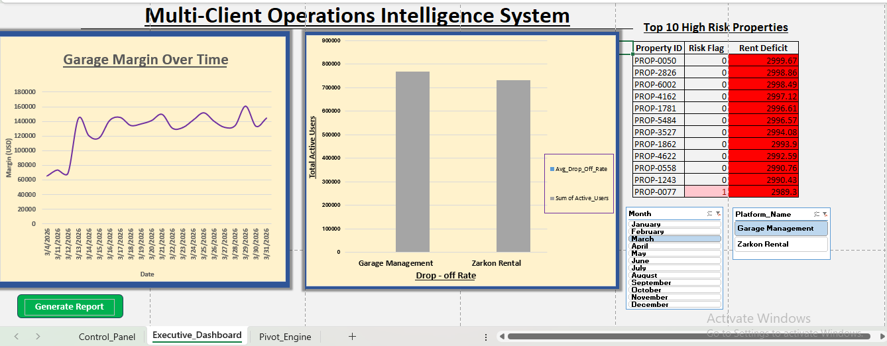
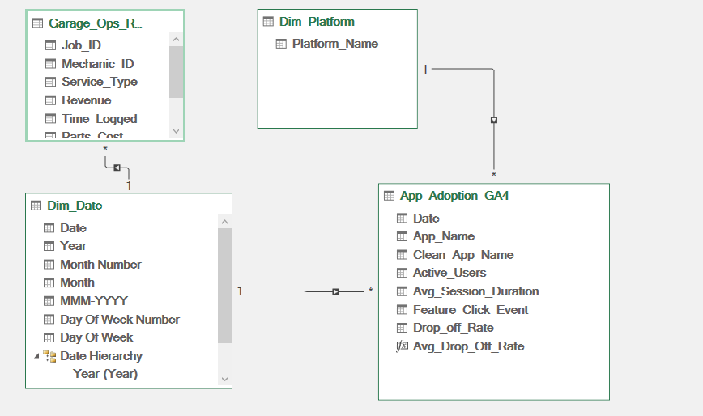
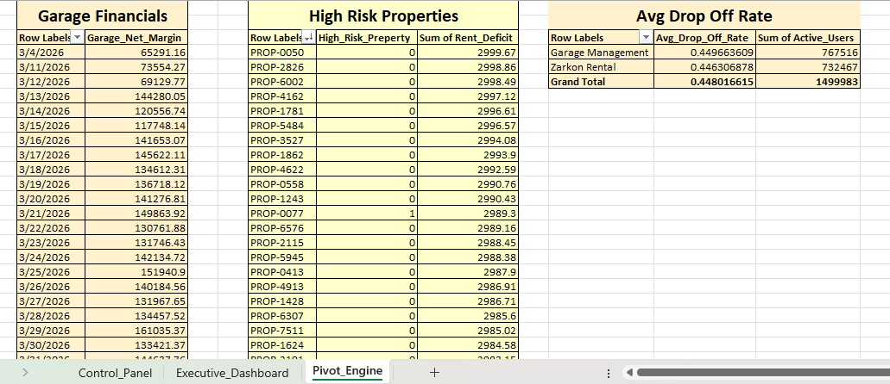

<br><br>

# Multi-Client Operations Intelligence System

**Excel · Power Query · Power Pivot · DAX · VBA · Google Apps Script**

---

## The Problem This Solves

Most mid-market software agencies  run three or four client products simultaneously. 

Each product generates its own operational data — job logs, rent collections, user behavior — stored in separate files, in different formats, with no unified view of what's working and what's failing.

This leads to


- Delayed identification of financial or operational risk
- Inability to compare performance across clients
- Reactive decision-making instead of proactive control


---
> How can multiple operational datasets be unified into a single BI layer that enables cross-client visibility, risk detection, and automated executive reporting — without a dedicated data warehouse?
---
This project builds the reporting infrastructure that eliminates that problem. 

It ingests messy operational data from three client products, cleans and models it, applies business logic, and delivers a single executive dashboard — refreshed and exported to PDF in one click.

No BI platform license required.

No data warehouse.

 No cloud dependency.
 
  It runs inside Excel.

---

## Business Scenario

A software company managing three client products:

| Client Product | Data Volume | Business Question |
|---|---|---|
| Garage Management Platform | 15,000 job records | Which service types are profitable after parts costs? Which mechanics are underperforming? |
| Rental App | 8,000 rental records | Which properties carry simultaneous rent deficits and unresolved maintenance backlogs — and how much is at risk? |
| App Adoption (GA4-style) | 4,000 session records | Is user volume masking a retention problem? Where are users dropping off? |

Three products. 

Three datasets.

 Three sets of data quality failures.
 
  One reporting system to surface all of it.

---

## What the Data Actually Looked Like

Real operational data is not clean. This project didn't use tidy CSVs.

**Garage Operations**
- 294 duplicate `Job_ID` entries caused by system sync errors
- Mixed date formats — `DD/MM/YYYY` and `MM/DD/YYYY` in the same column, from two regional offices
- 14.8% of `Parts_Cost` records were null (2,221 rows)

**Rentals Data**
- `Landlord_ID` encoded inconsistently as integers and strings in the same column
- Rent collected was zero, partial, or full with no consistent logic in the source system

**App Adoption**
- Eight different spellings for the same two app names across the GA4 export (`GarageOps`, `Garage_App`, `Garage Mgmt`, `Garage Platform`)

Cleaning this required a structured ETL pipeline, not a formula fix.

---

## How It Was Built

### ETL — Power Query

Each dataset was loaded and cleaned independently before being passed to the data model. Key decisions:

- **Mixed date formats:** A single locale setting fails on a mixed-format column. A custom M formula using `try...otherwise` logic attempts US parsing first, then falls back to UK format — handling both in a single pass without splitting the column.

- **Duplicate Job IDs:** Removed at source with downstream audit logging so the removal is traceable.

- **Null Parts Cost:** Replaced with `0` and flagged via a `Parts_Status` conditional column — so zero-cost jobs remain distinguishable from jobs where cost data is missing.

- **Type enforcement on calculated columns:** `Rent_Deficit` and `Unresolved_Tickets` computed in Power Query with explicit numeric casting — preventing DAX type mismatch errors that occur when inherited `Any` types reach the model.

- **App name standardization:** Conditional column mapped all eight name variants to two clean platform identifiers.

All queries loaded as Data Model connections only. No raw data written to worksheets.

### Data Model — Power Pivot Star Schema


Three fact tables connected through shared dimension tables:

- `Dim_Date` — continuous calendar table linked to job timestamps and rental dates
- `Dim_Platform` — lookup table connecting cleaned app names to client platform identifiers



### Business Logic — DAX

```dax
-- Flags properties presenting dual financial and operational risk
High_Risk_Property := IF(AND([Unresolved_Tickets] > 2, [Rent_Collected] < [Rent_Due]), 1, 0)

-- Net garage margin after parts costs
Garage_Net_Margin := SUM([Revenue]) - SUM([Parts_Cost])

-- Average session drop-off rate by platform
Avg_Drop_Off_Rate := AVERAGE([Drop_off_Rate])
```

### Dashboard

- Three Pivot Tables sourced from the Data Model (not raw sheets)
- Conditional formatting ranking rent deficits by severity
- Cross-filtered slicers connected across all three Pivot Tables via Report Connections
- Combo chart: user adoption volume vs. drop-off rate — surfaces whether growth is masking a retention problem


<br><br>

### Automation — VBA + Google Apps Script

A VBA macro runs the full refresh cycle:

1. Refreshes all Power Query connections and the Data Model
2. Recalculates What-If scenarios on the Control Panel
3. Exports the dashboard as a timestamped PDF
4. Opens the PDF immediately

Background refresh is disabled on all queries — this forces sequential execution so the PDF is never generated before the pipeline finishes.

A Google Apps Script simulates the external GA4 data drop (staging folder → fresh CSV), replicating what a scheduled API export would do in a production environment.

**One click. Refresh. PDF. Done.**

---

## What It Finds

- **Garage:** Which mechanics generate positive margin after parts costs, and which service types are loss-making
- **Rental:** Properties simultaneously carrying rent arrears and unresolved ticket backlogs — the highest-risk receivables in the portfolio
- **Adoption:** Whether the platform with higher user volume actually has stronger retention, or whether the numbers are hiding a drop-off problem

---

## Technical Stack

| Layer | Tools |
|---|---|
| ETL | Power Query  |
| Data Model | Power Pivot — Star Schema |
| Business Logic | DAX |
| Advanced Analytics | XLOOKUP, INDEX-MATCH, Goal Seek, What-If Analysis |
| Visualization | Pivot Tables, Pivot Charts, Conditional Formatting, Slicers |
| Automation | VBA, Google Apps Script |
| Output | `.xlsm` workbook, timestamped PDF |

---

## Project Structure

```
├── Data/
│   ├── Garage_Ops_Raw.csv
│   ├── Zarkon_Rentals_Raw.xlsx
│   └── App_Adoption_GA4.csv
├── Dashboard.xlsm
└── README.md
```

---

## How to Run

1. Clone the repository
2. Open `Dashboard.xlsm` in Excel and enable macros
3. Click **Generate Report** on the Executive Dashboard sheet
4. The pipeline refreshes and exports a timestamped PDF automatically


> The Google Apps Script component requires a Google account and separate deployment via Drive > Extensions > Apps Script.

---
## Strategic Positioning

This project is designed as a lightweight BI engineering prototype.


It simulates enterprise BI architecture using accessible tools where full data warehouse infrastructure is unavailable.

---
## Author

**Hannan Baig**

MS Computer Science — NUST | Data Analytics & BI

[muhammadhannanbaig@gmail.com](mailto:muhammadhannanbaig@gmail.com) 

· [LinkedIn](https://www.linkedin.com/in/hannan-baig/) 

· [GitHub](https://github.com/hannanbaig347)
